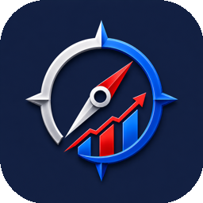
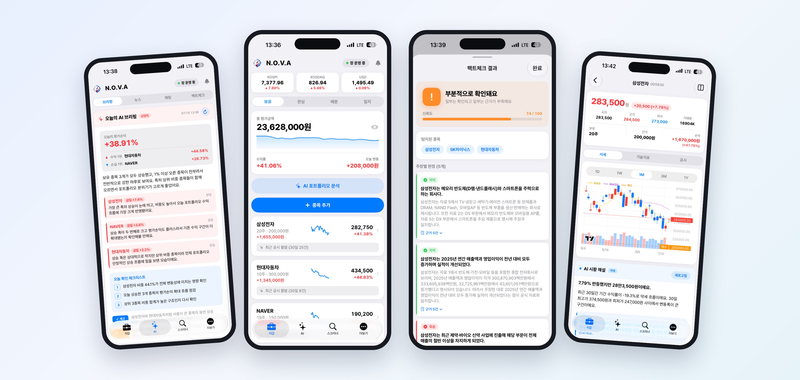
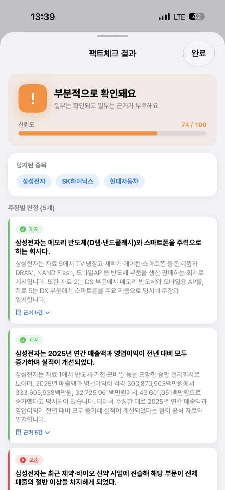
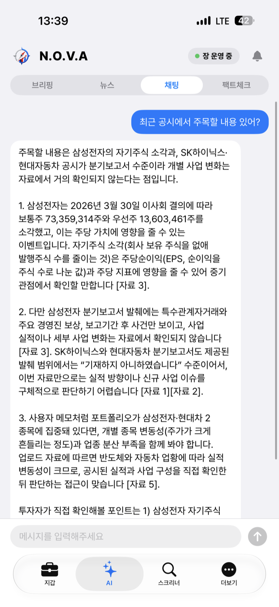
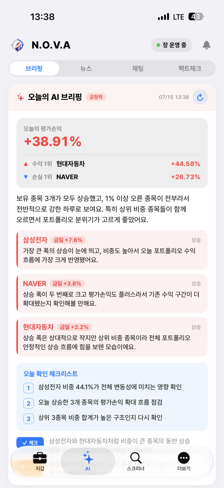
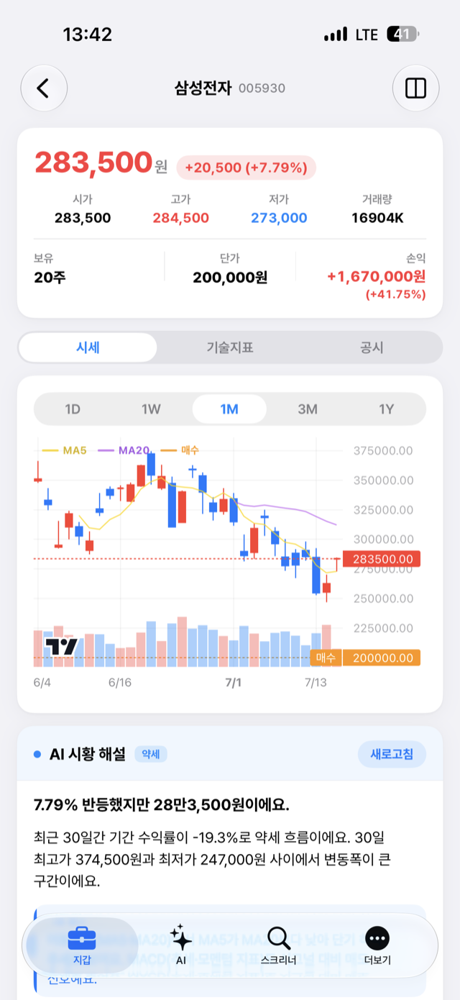
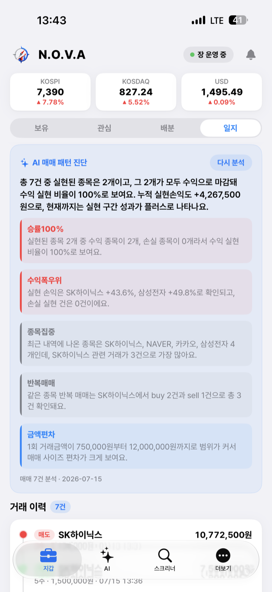
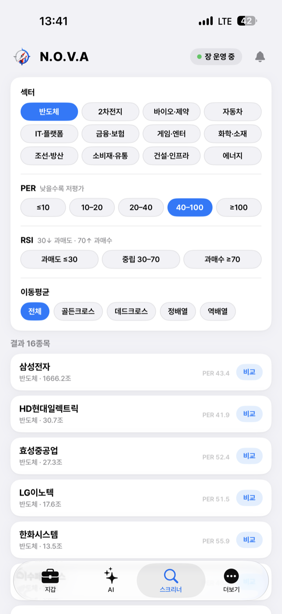
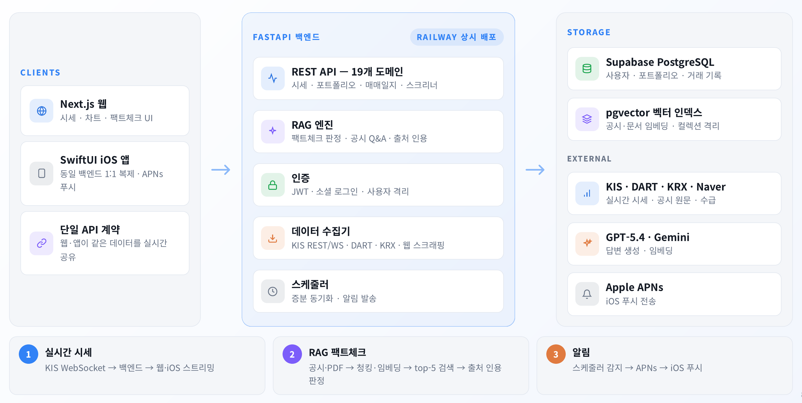

<div align="center">



# N.O.V.A

**N**avigation **O**f **V**alue **A**ssets — AI 기반 투자 인사이트 플랫폼

근거와 함께 답하는 AI 주식 비서.<br>
시세·포트폴리오·매매일지부터 공시 기반 팩트체크까지, **웹과 iOS가 하나의 백엔드를 공유**합니다.




</div>

> ⚠️ 본 서비스가 제공하는 정보·AI 분석은 투자 참고용이며 투자 자문이 아닙니다. 투자 판단과 그 결과의 책임은 이용자 본인에게 있습니다.

---

## 왜 N.O.V.A인가

LLM이 단순히 답만 하지 않습니다. **function calling으로 필요한 도구를 스스로 호출**해 실시간 시세·공시·기술적 지표·뉴스에서 근거를 모은 뒤 답하고, 받은 리포트·지라시는 **DART 공시와 교차검증(RAG)** 해 주장별로 판정합니다. 모든 답변에는 출처가 붙습니다.

---

## 주요 화면

<table>
  <tr>
    <td align="center" width="33%"><br><b>팩트체크</b><br><sub>주장별 지지·모순 판정 + 신뢰도 점수, 근거 문서 인용</sub></td>
    <td align="center" width="33%"><br><b>에이전틱 AI 채팅</b><br><sub>도구를 직접 호출해 근거를 모으고 [자료 N]으로 출처 인용</sub></td>
    <td align="center" width="33%"><br><b>오늘의 AI 브리핑</b><br><sub>내 포트폴리오 기준 데일리 코멘트·체크리스트</sub></td>
  </tr>
  <tr>
    <td align="center" width="33%"><br><b>실시간 시세·차트</b><br><sub>KIS WebSocket 체결가, MA·매수가 라인, AI 시황 해설</sub></td>
    <td align="center" width="33%"><br><b>AI 매매 패턴 진단</b><br><sub>승률·집중·반복매매 등 내 매매 습관 5개 관점 리포트</sub></td>
    <td align="center" width="33%"><br><b>종목 스크리너</b><br><sub>섹터·PER·RSI·이동평균 조건 필터링</sub></td>
  </tr>
</table>

---

## 기능 전체

| 기능 | 내용 |
|------|------|
| **에이전틱 AI 어시스턴트** | LLM이 function calling으로 도구를 직접 호출해 근거를 모아 답변 |
| **투자 정보 팩트체크** | 리포트·뉴스·지라시를 DART 공시와 교차검증(pgvector RAG), 신뢰도 🟢/🟡/🔴 판정 |
| **오늘의 AI 브리핑 / 뉴스 요약** | 보유 종목 기준 데일리 브리핑, 개장 전 뉴스 긍정·부정 분류 |
| **실시간 시세 & 차트** | 한국투자증권(KIS) REST/WebSocket 실시간 가격·분봉 차트 + AI 시황 해설 |
| **AI 포트폴리오 분석** | 보유 종목 구조화 카드 분석 + 참고 자료 출처 제시 |
| **AI 매매 패턴 진단** | 거래 이력을 승률·수익폭·집중도·반복매매·금액편차 5개 관점으로 진단 |
| **매매 일지** | 거래 기록·실현 손익 자동 집계 |
| **종목 스크리너 · 비교** | 조건 기반 필터링, 종목 나란히 비교 |
| **투자 성향 프로필** | 위험 성향·목표·관심 섹터 기반 AI 답변 개인화 |
| **알림 & 푸시** | 스케줄러 감지 → iOS APNs 푸시 |

> 🛠️ **AI가 호출하는 도구** — `get_stock_price` · `get_portfolio` · `search_recent_news` · `get_technical_indicators` · `get_dart_disclosures` · `screen_stocks`

대부분의 기능은 웹과 iOS 양쪽에서 동일하게 제공됩니다.

---

## 아키텍처

<div align="center">

</div>

**RAG 팩트체크 파이프라인** — DART 공시·사용자 PDF를 800자 단위(오버랩 150자)로 청킹 → Gemini 임베딩(gemini-embedding-001, 3072차원) → PostgreSQL pgvector 저장. 공용 자료(trusted)와 사용자 업로드를 컬렉션으로 격리해 남의 문서가 검색되지 않는 멀티테넌시를 강제하고, 질문마다 top-5 유사도 검색 후 출처를 인용해 판정합니다.

**엔지니어링 하이라이트**

- **팩트체크 응답 142초 → 약 8초** — 요청마다 공시 전체를 재수집하던 구조를 증분 동기화 + 병렬 수집으로 재설계
- **KIS 토큰 캐싱** — 발급이 하루 1회로 제한되는 KIS API 정책에 맞춘 토큰 재사용 구조
- **멀티유저 보안** — 독립 AI 리뷰 프로세스로 수평 권한·APNs 토큰 누수를 발견·수정, 인증·데이터 접근 경로에 사용자 격리 일괄 적용
- **웹·iOS 단일 API 계약** — 두 클라이언트가 같은 백엔드(19개 REST 도메인)를 공유

---

## iOS 앱 (NOVA)

SwiftUI로 구현한 네이티브 iOS 앱. 웹과 동일한 백엔드를 공유하며, Toss 스타일 디자인(Pretendard 폰트)으로 네이티브 경험을 제공합니다.

- **하단 4탭** — 💼 지갑(포트폴리오·관심종목·배분·일지) / ✨ AI(브리핑·뉴스·채팅·팩트체크) / 🔍 스크리너 / ⋯ 더보기
- **실시간** — WebSocket 실시간 시세 갱신 + 가격 변동 이펙트, 끊김 시 자동 재연결
- **인증** — Google Sign-In, 토큰 Keychain 보관, 세션 만료 처리
- **푸시** — APNs 푸시 알림 (실기기 검증)

> iOS 앱은 별도 Xcode 프로젝트(`NOVA`)로 관리됩니다. 이 저장소에는 백엔드·웹과 iOS 마이그레이션 명세(`docs/ios-migration-plan.md`)가 포함됩니다.

---

## 기술 스택

**백엔드**
- FastAPI (Python 3.12)
- LLM: OpenAI gpt-5.4 (일반 호출 mini / 브리핑 full 하이브리드) — function calling(tool use) 기반
- RAG: PostgreSQL pgvector + Gemini 임베딩(gemini-embedding-001)
- 데이터 소스: 한국투자증권(KIS) REST·WebSocket, KRX, DART 공시, 네이버(외인·기관 순매수), 웹 검색
- DB: PostgreSQL (Supabase) · 푸시: APNs (HTTP/2) · 모니터링: Sentry

**웹 프론트엔드**
- Next.js (App Router) + Tailwind + shadcn/ui
- 인증: NextAuth

**iOS**
- SwiftUI (iOS 26.5+, Swift 5), GoogleSignIn, APNs — 별도 Xcode 프로젝트

**배포**
- Railway (백엔드/웹 상시 운영)

---

## 폴더 구조

```
stock-compass/
├── backend/                 FastAPI 백엔드
│   └── app/
│       ├── api/             엔드포인트 19개 도메인 (ask·factcheck·realtime·screener·trades·portfolio 등)
│       ├── collectors/      데이터 수집기 (kis_rest·kis_ws·krx·dart·web_search·ta_engine)
│       ├── rag/             팩트체크 / QA RAG (factcheck.py·qa.py)
│       ├── llm/             LLM 래퍼 (openai_llm·gemini)
│       ├── tools.py         function calling 도구 정의·실행
│       ├── push/            APNs 푸시
│       ├── scheduler/       백그라운드 작업 (증분 동기화·알림)
│       ├── parsers/         PDF·URL 파서 (청킹)
│       ├── db/              DB·pgvector 클라이언트
│       └── config.py
├── frontend/                Next.js (App Router)
└── docs/                    iOS 마이그레이션 명세 + 기능별 spec/plan
```

---

## 셋업 & 실행

### 백엔드
```bash
cd backend
python3 -m venv venv
source venv/bin/activate
pip install -r requirements.txt
uvicorn main:app --reload
```

환경 변수(`.env`)에 KIS·OpenAI·Gemini·DART API 키, PostgreSQL 접속 정보, (선택) Sentry DSN·APNs 키가 필요합니다.

### 웹 프론트엔드
```bash
cd frontend
npm install
npm run dev
```

브라우저에서 http://localhost:3000 으로 접속합니다.

### iOS 앱
별도 `NOVA` Xcode 프로젝트를 열어 빌드합니다.

```bash
open NOVA.xcodeproj
```

- APNs 푸시·소셜 로그인 테스트는 **실기기 권장** (시뮬레이터는 푸시 토큰 미발급)
- 기본적으로 Railway 배포 백엔드를 바라봅니다 (`APIConfig`에서 설정)
